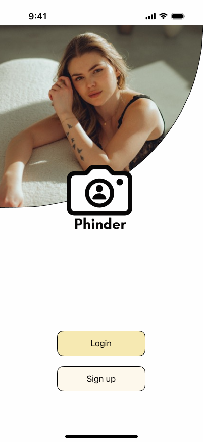
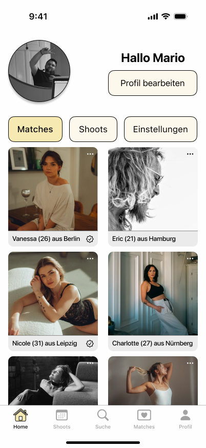
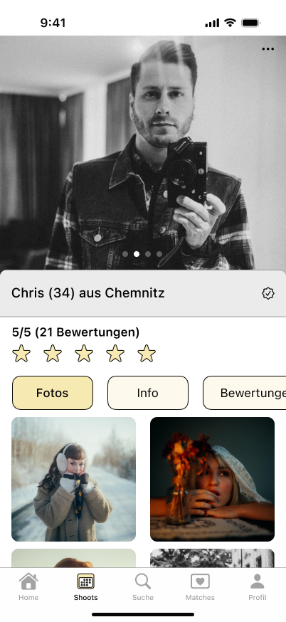

# Phinder

**Die All in One Lösung für Modelle und Fotografen**

Phinder ist DIE App, für Modelle und Fotografen - oder auch die, die es gerne werden wollen. Du bist auf der Suche nach einem Model aus deiner Gegend? Dann swipe dich durch die Liste und Suche nach den Kriterien, die für dich wichtig sind. 
Du hast einen Fotografen und willst schauen wie zuverlässig er ist? Schaue dir bisher bewertete Shoots von anderen Modellen an. 

Egal ob es um die Planung deines nächsten Shoots geht, das finden einer passenden Person in einer fremden Stadt oder die Suche nach passenden Studios. 
Mit Phinder ist das alles möglich!

## Design

  
  
  

## Features

- [ ] Model- & Fotografensuche
- [ ] Filtersystem um passende Personen zu finden
- [ ] Umkreissuche
- [ ] Bewerten von Shoots
- [ ] Bewertung andere Personen lesen
- [ ] Präsentieren der eigenen Arbeiten

## Technischer Aufbau

#### Projektaufbau
Ich verwende die MVVM Architektur. 
Dabei werde ich einen Ordner mit Modellen haben, welcher die Datenstruktur enthält.
Weiterhin wird es einen View Ordner geben, welcher Dateien enthält, die für die UI zuständig ist. 
Im ViewModel Ordner werden die Logiken und Funktionen liegen, für die jeweilieg View.
Im Repository Ordner werde ich die API Calls sowie die Datenbank Zugriffe speichern.

#### Datenspeicherung
Für die User- & Datenspeicherung möchte ich eine Firebase Datenbank verwenden. 

#### API Calls
Folgende API Calls verwende ich:

https://openweathermap.org/api

#### 3rd-Party Frameworks
Firebase Framework

## Ausblick

- [ ] Abspeichern Ideen mit einem Fotografen / Model
- [ ] Überblick über bisherige Shoots
- [ ] Matchsystem
- [ ] Suche nach Location (Airbnb & Studios)
- [ ] Planung anstehender Shoots in der App (Datum, Uhrzeit, Ort etc.)
